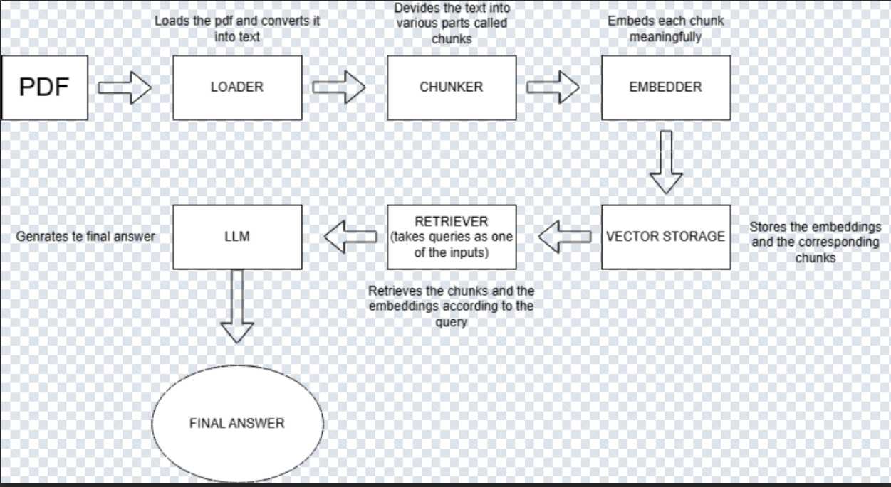

# RAG-built-from-scratch-v3

Retrieval-Augmented Generation from Scratch for Document-Grounded Question Answering

(Conversational RAG, Single-Document Setting)

##Abstract

This project presents a from-scratch implementation of a Retrieval-Augmented Generation (RAG) system for document-grounded question answering over PDF documents.
Unlike most contemporary RAG implementations, this system is explicitly constructed without high-level orchestration frameworks such as LangChain or LlamaIndex, in order to expose and reason about the internal mechanics of retrieval-based language systems.

The system integrates semantic retrieval with an instruction-tuned large language model, enforcing strict context grounding and deterministic generation. A conversational interaction loop is introduced to support multi-turn querying within a single session.

The primary objective of this work is conceptual clarity and architectural understanding, not production deployment.

##Architecture Overview

##1. Motivation

Recent RAG systems frequently abstract away core components—retrieval, similarity computation, context construction, and generation control—behind high-level APIs. While effective for rapid prototyping, such abstractions obscure the underlying mechanics that govern correctness, hallucination behavior, and retrieval failure modes.

This project was designed with the following goals:

To implement each RAG component manually, from document ingestion to answer generation

To understand how retrieval quality directly affects generation reliability

To enforce hard grounding constraints on the language model

To serve as a learning artifact and portfolio demonstration, not a production system

##2. System Overview

The system follows a classical RAG architecture, extended with a conversational inference loop:

PDF Document
   ↓
Loader → Chunker → Embedder → Vector Store
                                   ↓
User Query → Retriever → Context Injection → LLM → Answer
                                   ↑
                           Session Message History

Each component is intentionally lightweight, transparent, and replaceable.

##3. Pipeline Description
##3.1 Document Ingestion (Loader)

The Loader extracts raw textual content from PDF files. No semantic processing is performed at this stage; the objective is faithful text extraction.

##3.2 Text Chunking (Chunker)

The extracted text is divided into semantically manageable chunks. Chunking is necessary to:

Fit retrieval into a fixed embedding space

Improve semantic resolution during similarity search

Prevent dilution of relevance across long documents

##3.3 Embedding Generation (Embedder)

Each chunk is converted into a dense vector representation using a sentence-transformer model. These embeddings form the basis of semantic similarity comparison.

##3.4 Vector Storage

Embeddings and their corresponding text chunks are stored in-memory using native Python data structures. This design choice favors algorithmic transparency over scalability.

##3.5 Similarity-Based Retrieval (Retriever)

For a given query:

The query is embedded into the same vector space

Cosine similarity is computed against all stored embeddings

The top-k most relevant chunks are selected as contextual evidence

This step is intentionally explicit to allow inspection of retrieval behavior.

##3.6 Context Injection and Generation

Retrieved chunks are injected directly into the LLM prompt as explicit context. The language model is instructed to:

Use only the provided context

Avoid external or prior knowledge

Explicitly refuse to answer when evidence is insufficient

A low-temperature, deterministic decoding strategy is used to prioritize factual consistency.

##4. Conversational Extension

Unlike earlier single-turn designs, this version introduces a persistent interaction loop:

Users may ask multiple questions in a single session

System instructions remain fixed

User queries and assistant responses are appended to a message history

Each turn performs fresh retrieval, ensuring document grounding is preserved

The conversation terminates explicitly via a user command.

##5. Hallucination Control Strategy

Hallucination is mitigated through architectural constraints rather than post-processing:

Context-restricted prompting

Deterministic generation (no sampling)

Explicit refusal instruction when evidence is missing

Retrieval-driven context selection

The system does not attempt to “sound confident” when evidence is weak.

##6. Model and Framework Details

Embedding Model: Sentence-Transformers (semantic sentence embeddings)

Language Model: LLaMA 3.2 3B Instruct

Quantization: 4-bit (BitsAndBytes)

Inference Framework: Hugging Face Transformers

Backend: PyTorch

Execution Environment: Google Colab (GPU-enabled)

Quantization is employed to enable efficient inference under limited hardware constraints.

##7. Example Interaction

User Query:
Why were people of Germany angry with the Weimar Republic?

System Behavior:

Retrieves economically and politically relevant document sections

Generates a structured summary grounded entirely in retrieved evidence

Avoids extrapolation beyond the document

System Output:

Economic hardship and inflation

War guilt and national humiliation

Political instability and coalition governments

Constitutional weaknesses (e.g., Article 48)

##8. Design Philosophy

Key design principles guiding this work:

Transparency over abstraction

Explicit control over retrieval and generation

Minimal dependencies

Interpretability over performance

Learning-first, deployment-later mindset

##9. Current Limitations

Single-document ingestion

In-memory vector storage (no ANN indexing)

No automated follow-up detection

Conversation history grows unbounded within a session

Cleaner output is currently used for inspection, not reinjection

These limitations are intentional trade-offs, not oversights.

##10. Future Work

Potential extensions include:

Context window management

Follow-up question detection

Multi-document retrieval

FAISS-based scalable indexing

Evaluation metrics for retrieval quality

Deployment-oriented API layer

##Author

##Aarav
##Student | AI & Machine Learning Enthusiast

This project was developed independently to understand Retrieval-Augmented Generation systems at the architectural level, rather than through framework-driven abstraction.
